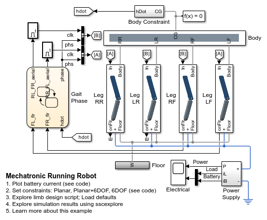
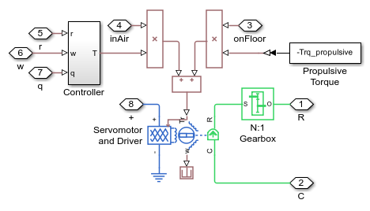

# **Running Robot Model in Simscape**
Copyright 2012-2023 The MathWorks(TM), Inc.

This example shows how simulation tools can be used to support the
design of a running robot. See Hyde, R.A. and Wendlandt, J. "Tool-Supported Mechatronic System
Design", 34th Annual Conference of the IEEE Industrial Electronics Society, 10-13th November
2008, Orlando, Florida for more background information.

Open Robot_Run_4Legs.prj to begin.

View on File Exchange:   
You can also open in MATLAB Online: 

## **Main Model**

## **Motor Model**

## **Control Logic**

